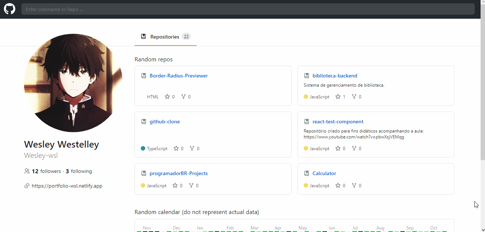

# Github Clone

## Demo 📸

 

## Application deploy with netlify: :dash:

> https://github-clone-wsl.netlify.app

## 📜 About the Project

This is a simple github clone.

### 🛠 Technologies

<li><a href="https://reactjs.org">React.js</a></li>
<li><a href="https://styled-components.com">Styled-components</a></li>
<li><a href="https://www.npmjs.com/package/react-calendar-heatmap">react-calendar-heatmap</a></li>
<li><a href="https://date-fns.org">date-fns</a></li>
<li><a href="https://www.typescriptlang.org">TypeScript</a></li>
<li><a href="https://editorconfig.org">EditorConfig</a></li>

## 💻 How to run the application

#### Pre-requisites:
You must have the tools installed:  <a href="">Git</a>, <a href="">Node.js</a>.

<pre>
# In the terminal, clone the project:
$ git clone https://github.com/Wesley-wsl/github-clone.git

# Enter the project folder:
$ cd github-clone

# Install dependencies:
$ yarn install
or
$ npm install

# Run the application:
$ yarn start
or
$ npm run start
</pre>

Okay, now you can access the application from the route:  <a href="https://localhost:3000/">https://localhost:3000/</a>
